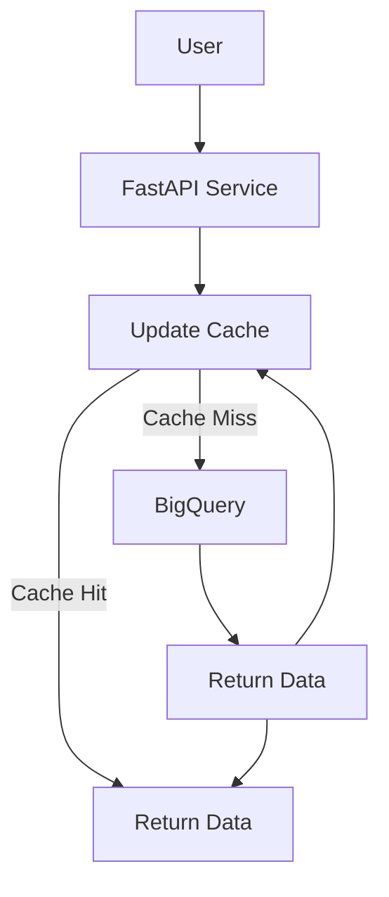
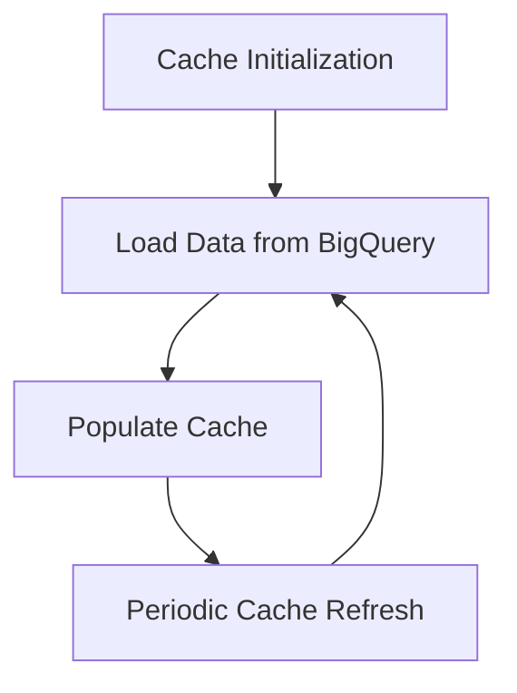
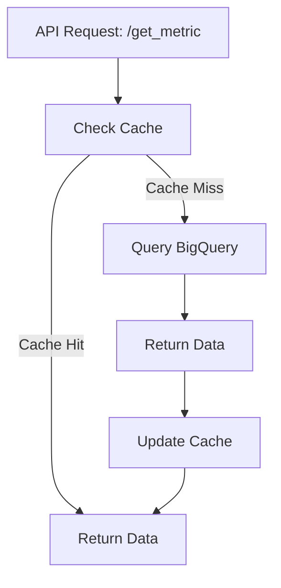

## Architecture Diagrams

### System Architecture

How Cache Works
Cache Initialization:

On startup, the cache is initialized and periodically refreshed every 10 hours with data from BigQuery.
Cache Check:

When a request is made to get_metric, the service first checks if the data is in the cache.
If a cache hit occurs, the data is returned from the cache.
If a cache miss occurs, the service queries BigQuery for the data, updates the cache, and returns the data to the user.
Cache Refresh:

The cache is refreshed every 10 hours by querying all necessary data from BigQuery.
Error Handling
The service includes comprehensive error handling, including:

Logging of unhandled exceptions.
Handling BigQuery BadRequest exceptions.
Returning appropriate HTTP status codes and error messages for client and server errors.
Running the Server
To run the server locally:

bash
Copy code
uvicorn app:app --reload
The service will be available at http://127.0.0.1:8000.

Contributing
We welcome contributions! Please read our contributing guidelines for more details.

License
This project is licensed under the MIT License - see the LICENSE file for details.